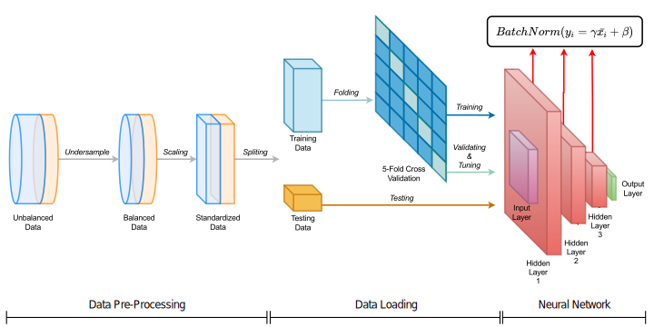

<h1> A Deep Learning Approach to Diabetes Diagnosis  <a href="https://aciids.pwr.edu.pl/2024/">ACIIDS 2024</a> </h1>

[Zeyu Zhang](https://steve-zeyu-zhang.github.io), [Khandaker Asif Ahmed](https://scholar.google.com/citations?user=rUJ9DVAAAAAJ&hl=en), [Md Rakibul Hasan](https://staffportal.curtin.edu.au/staff/profile/view/rakibul-hasan-145a1046/), [Md Zakir Hossain](https://sites.google.com/view/zakirh?pli=1)

    

_Diabetes, resulting from inadequate insulin production or
utilization, causes extensive harm to the body. Existing diagnostic methods are often invasive and come with drawbacks, such as cost constraints.
Although there are machine learning models like Classwise k Nearest
Neighbor (CkNN) and General Regression Neural Network (GRNN),
they struggle with imbalanced data and result in underperformance.
Leveraging advancements in sensor technology and machine learning,
we propose a non-invasive diabetes diagnosis using a Back Propagation
Neural Network (BPNN) with batch normalization, incorporating data
re-sampling and normalization for class balancing. Our method addresses
existing challenges such as limited performance associated with traditional machine learning. Experimental results on three datasets show
significant improvements in overall accuracy, sensitivity, and specificity
compared to traditional methods. Notably, we achieve accuracies of **89.81%**
in Pima diabetes dataset, **75.49%** in CDC BRFSS2015 dataset, and
**95.28%** in Mesra Diabetes dataset. This underscores the potential of advanced deep learning models, including Transformers, for robust diabetes
diagnosis._

